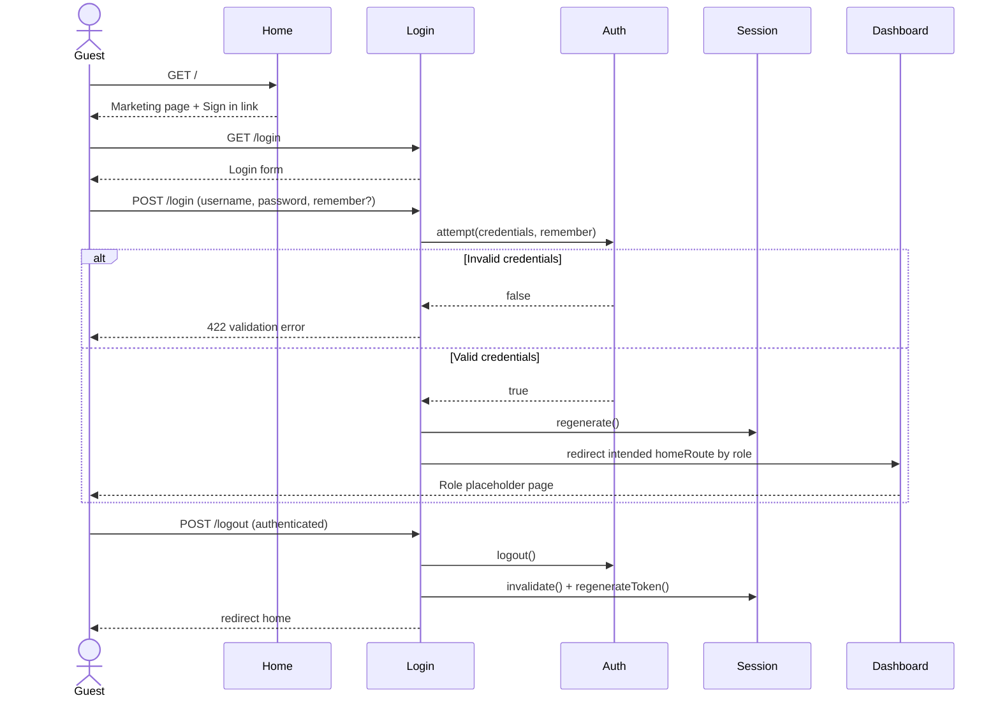

# Phase 1, Epic 1 — Authentication & Session

## Sequence

## Role redirects

| Role | Route | Path |
|------|-------|------|
| student | `student.dashboard` | `/student` |
| teacher | `teacher.submissions.index` | `/teacher/submissions` |
| admin | `manage.quizzes.index` | `/manage/quizzes` |

## Manual QA

1. Run `php artisan migrate:fresh --seed`.
2. Open `/` — confirm hero text and **Sign in** button.
3. Open `/login` — confirm username/password form and remember-me checkbox.
4. Log in as `student` / `password` — confirm redirect to `/student`.
5. Log out — confirm redirect to `/` and protected routes require login again.
6. Log in as `teacher` / `password` — confirm redirect to `/teacher/submissions`.
7. Log in as `admin` / `password` — confirm redirect to `/manage/quizzes`.
8. While logged in, visit `/login` — confirm redirect to role home.
9. Submit wrong password — confirm error on username field, stay logged out.

## Seed accounts

| Username | Password | Role |
|----------|----------|------|
| student | password | student |
| teacher | password | teacher |
| admin | password | admin |
