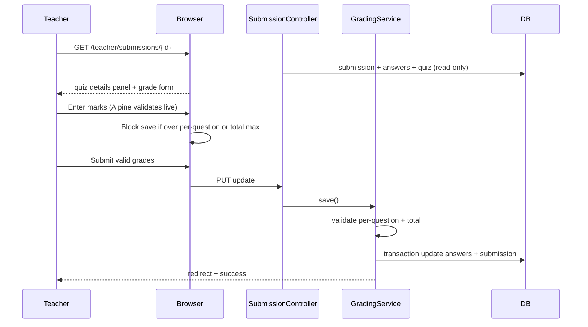

# Phase 1, Epic 10 — Teacher Grading

**Phase:** 1 · **Epic:** 10  
**Status:** Complete (mark validation + quiz info panel)

## Sequence



## Manual testing

### Prerequisites

```bash
php artisan migrate:fresh --seed
npm run dev
php artisan serve
```

Log in as **teacher** / **password**. Complete a **Speak Up** quiz as **student** (recording answers) so it appears in **Ready to grade**.

### 1. Quiz info (read-only)

1. Open **Grade** on a pending submission.

**Expected:** Panel shows total marks, mark per question max, description, question types. No quiz edit controls.

### 2. Speaking answer max hint

1. Find a **Speak** (recording) question.

**Expected:** Label “Speaking answer — grade out of X marks max.” Audio player if uploaded.

### 3. Live total validation

1. Enter marks that sum **above** quiz total.

**Expected:** Running total bar turns red; **Save grading** disabled.

### 4. Per-question validation

1. Enter a mark **above** per-question max on one answer.

**Expected:** Inline error under that field; Save disabled.

### 5. Server validation

1. Bypass UI (or use invalid total) via form tampering if needed.

**Expected:** Redirect back with validation errors; submission stays `pending`.

### 6. Successful save

1. Enter valid marks within caps → **Save grading**.

**Expected:** Status `graded`, total_mark = sum, success flash.

## Automated tests

```bash
php artisan test --filter=GradingTest
```
