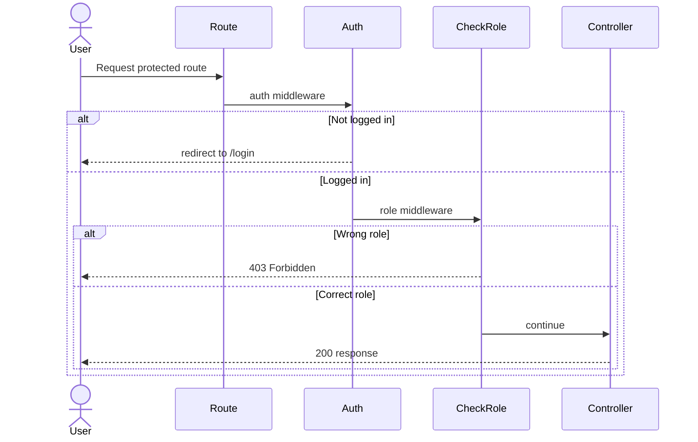
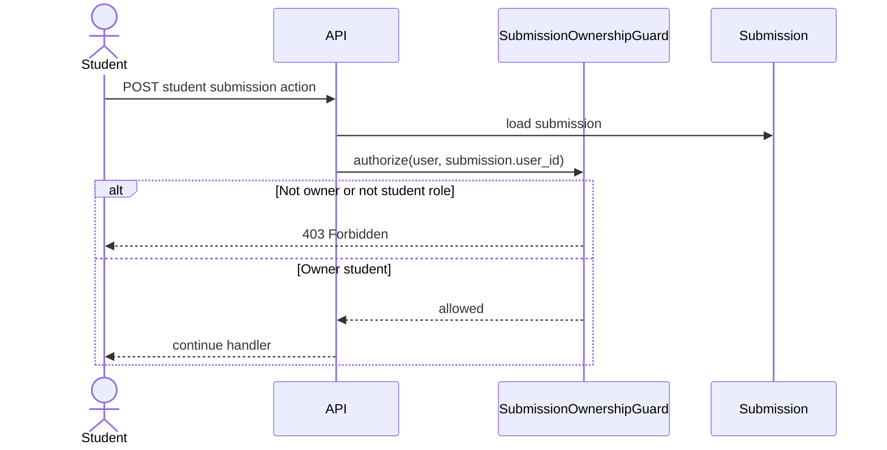

# Phase 1, Epic 2 — Authorization & Role Access

## Sequence

## Student submission ownership (API guard)

## Route protection

| Route | Middleware | Roles |
|-------|------------|-------|
| `/student` | `auth`, `role:student` | student |
| `/teacher/submissions` | `auth`, `role:teacher` | teacher |
| `/manage/quizzes` | `auth`, `role:admin` | admin |

## Manual QA

1. Log in as `student` / `password`.
2. Visit `/student` — should load.
3. Visit `/teacher/submissions` — should show **403 Forbidden**.
4. Visit `/manage/quizzes` — should show **403 Forbidden**.
5. Log out. Log in as `teacher` / `password`.
6. Visit `/teacher/submissions` — should load.
7. Visit `/student` and `/manage/quizzes` — both **403**.
8. Log in as `admin` / `password`.
9. Visit `/manage/quizzes` — should load.
10. Visit `/student` and `/teacher/submissions` — both **403**.

## Notes

- `SubmissionOwnershipGuard` is wired into student submission APIs in Epic 7.
- `CheckRole` middleware alias: `role:student`, `role:teacher`, `role:admin`.
