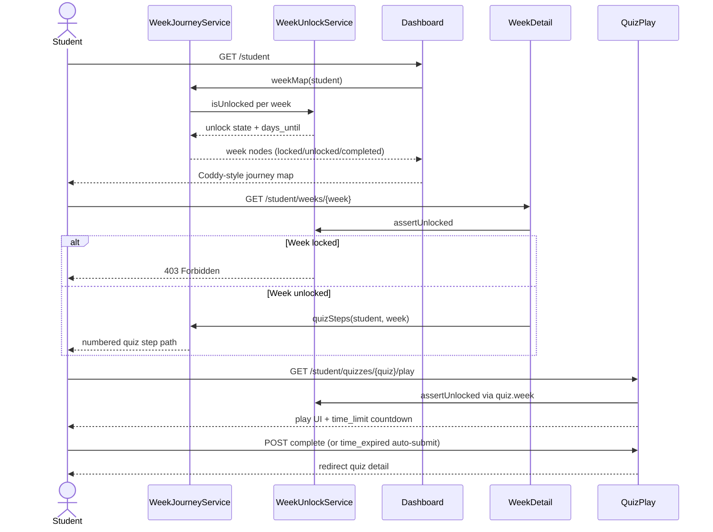

# Phase 2, Epic 1 — Week Management & Gamification Journey

## Sequence



## Unlock schedule (seed program)

| Week | unlock_after_days | Example (register Jan 1) |
|------|-------------------|--------------------------|
| 1 | 0 | Jan 1 |
| 2 | 7 | Jan 8 |
| 3 | 14 | Jan 15 |
| 4 | 21 | Jan 22 |

Each week contains **4 quizzes** with time limits: 3 min, 5 min, 7 min, 10 min.

### Quiz slots per week (seed program)

| Slot | Title | Question types | Count |
|------|-------|----------------|-------|
| 1 | Quick Choose | Choose (MC) only | 3 |
| 2 | Grammar Choose | Choose (MC) only | 3 |
| 3 | Speak Up | **Speak (recording)** only | 2 |
| 4 | Choose & Speak | Choose + Speak | 2 MC + 1 recording |

Student-facing tags: **Choose**, **Speak**. Record button appears only on **Speak** questions.

## Manual QA

1. Run `php artisan migrate:fresh --seed`.
2. Log in as **`student`** / `password`.
3. Open `/student` — confirm **Week by week** journey (not flat quiz cards).
4. Week 1 node is gold/unlocked; weeks 2–4 show lock + days remaining.
5. Tap Week 1 — confirm vertical **quiz step path** with 4 quizzes.
6. Start a quiz — confirm **timer** appears (e.g. 3:00 countdown).
7. Complete quiz — confirm score on step; **Play again** works (retake).
8. Log in as **`student_allweeks`** / `password` — all 4 weeks unlocked.
9. Log in as **`student_jan1`** / `password` — verify unlock dates follow Jan 1 anchor.
10. Try `/student/weeks/{week2}` as `student` — expect **403**.
11. Legacy quizzes without `week_id` (Speaking Basics) remain accessible if linked directly.
12. Open **Week 1 · Speak Up** — confirm **Speak** tag and **Record** button on play screen.
13. Open **Week 1 · Choose & Speak** — question 3 shows Record; questions 1–2 are Choose only.

## Seed accounts

| Username | Password | Purpose |
|----------|----------|---------|
| student | password | Week 1 only |
| student_allweeks | password | All weeks unlocked |
| student_jan1 | password | Registered 2026-01-01 |

## Database checks

```sql
SELECT week_number, title, unlock_after_days FROM weeks ORDER BY week_number;
SELECT w.week_number, q.title, q.time_limit_seconds FROM quizzes q JOIN weeks w ON q.week_id = w.id ORDER BY w.week_number, q.sort_order_in_week;
```

Expect 4 weeks and 16 program quizzes (plus 2 legacy unscoped quizzes).

## Automated tests

```bash
php artisan test
```

| Test file | Covers |
|-----------|--------|
| `WeekUnlockTest` | Day-based unlock rules, 403 on locked week/quiz |
| `WeekJourneyTest` | Journey map + week detail render |
| `WeekProgramSeedTest` | Seeder layout, Choose/Speak types, tags, play UI |
| `QuizTimeLimitCompleteTest` | `time_expired` auto-submit path |
| `QuizCatalogTest` | Active weeks on dashboard |
| `SubmissionLifecycleTest` | Recording upload + complete (Phase 1) |
