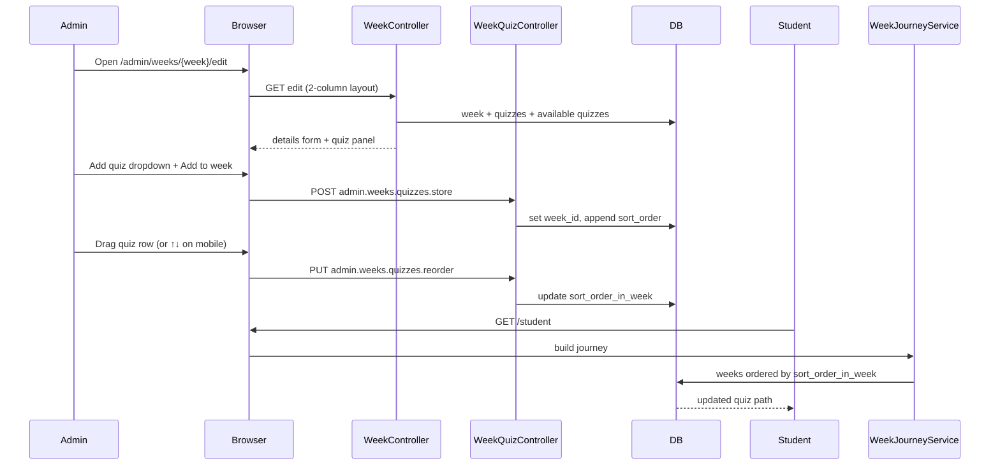

# Phase 2, Epic 2 — Admin Week Management

**Phase:** 2 · **Epic:** 2  
**Status:** Complete (UX enhanced)

## Sequence



## Manual testing

### Prerequisites

```bash
php artisan migrate:fresh --seed
npm run dev
php artisan serve
```

Log in as **admin** / **password**.

### 1. Edit week layout (desktop)

1. **Weeks** → edit any week.
2. Confirm **two columns** on wide screens: week details left, quizzes right.
3. No large empty gap on the right.

**Expected:** Full-width use on desktop; stacked on mobile.

### 2. Create week → add quizzes

1. **Create week** → save.
2. Redirect lands on **edit** page with empty quiz panel.

**Expected:** Flash: “Week created. Add quizzes below.”

### 3. Add quiz from week edit

1. Use **Choose a quiz to add** dropdown → **Add to week**.

**Expected:** DB `quizzes.week_id` set; student week path shows quiz.

### 4. Quiz edit — time limit only

1. **Quizzes** → edit any quiz.

**Expected:** **Time limit (seconds)** field only. No week dropdown or order field.

### 5. Drag-and-drop order (desktop)

1. Drag quiz rows to reorder.
2. Refresh page — order persists.

**Expected:** `sort_order_in_week` matches visual order.

### 6. Reorder on mobile

1. Narrow viewport (or phone).
2. Use **↑ / ↓** buttons on each row.

**Expected:** Order saves same as drag on desktop.

### 7. Remove quiz from week

1. Click **Remove** on a quiz row.

**Expected:** Quiz unassigned (`week_id` null); still exists in Quizzes admin.

### 8. Student journey

1. Log in as **student_allweeks**.
2. Open week path — quiz order matches admin order.

### 9. Authorization

1. As **student**, POST to `/admin/weeks/{id}/quizzes`.

**Expected:** 403 Forbidden.

## Automated tests

```bash
php artisan test --filter=WeekManagementTest
```
