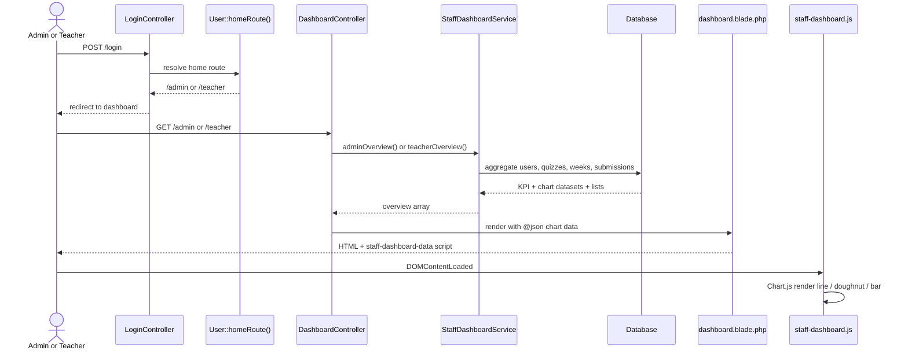

# Phase 2, Epic 3 — Staff Dashboards

## Sequence



## Manual QA

### Setup

```bash
php artisan migrate:fresh --seed
npm run build   # or npm run dev
php artisan serve
```

### Admin dashboard

1. Login `admin` / `password` → lands on `/admin`.
2. Confirm KPI cards: students, teachers, active quizzes, pending grades.
3. Confirm three charts render (line, donut, bar).
4. Click **Create week** quick action → week create form.
5. Recent activity shows seeded submissions (if any) with **View quiz** links.

### Teacher dashboard

1. Login `teacher` / `password` → lands on `/teacher`.
2. Confirm **Ready to grade** KPI matches `/teacher/submissions?filter=ready` count.
3. Priority queue lists oldest pending submissions with **Grade** buttons.
4. Click **Grade** → grade screen loads.
5. Charts render without console errors.

### Cross-role

1. As `teacher`, open `/admin` → **403**.
2. As `admin`, open `/teacher` → **403**.

### Mobile

1. Resize to phone width — KPI cards stack; charts remain readable.

### Automated

```bash
php artisan test --filter=DashboardTest
```
