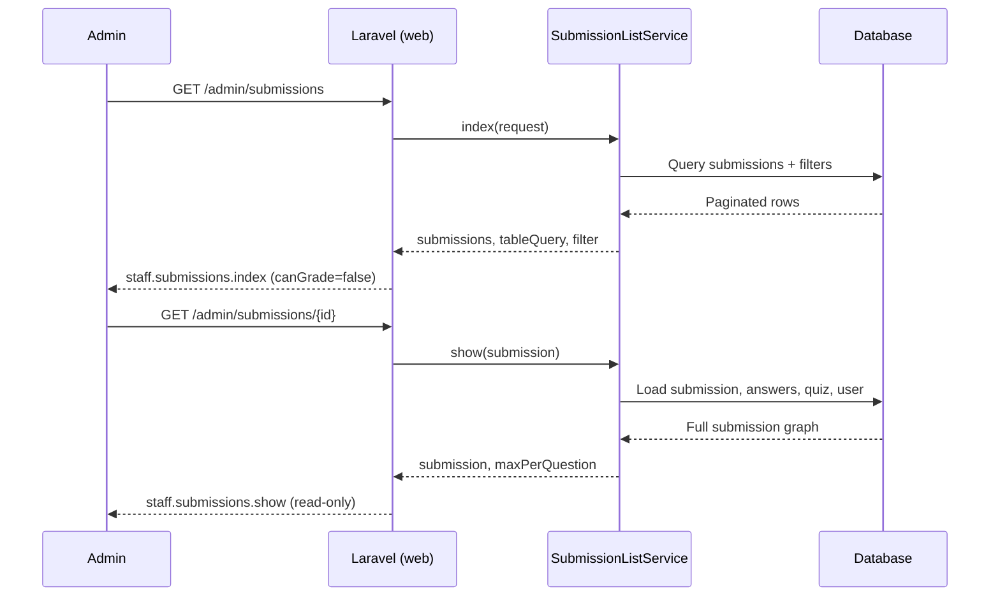
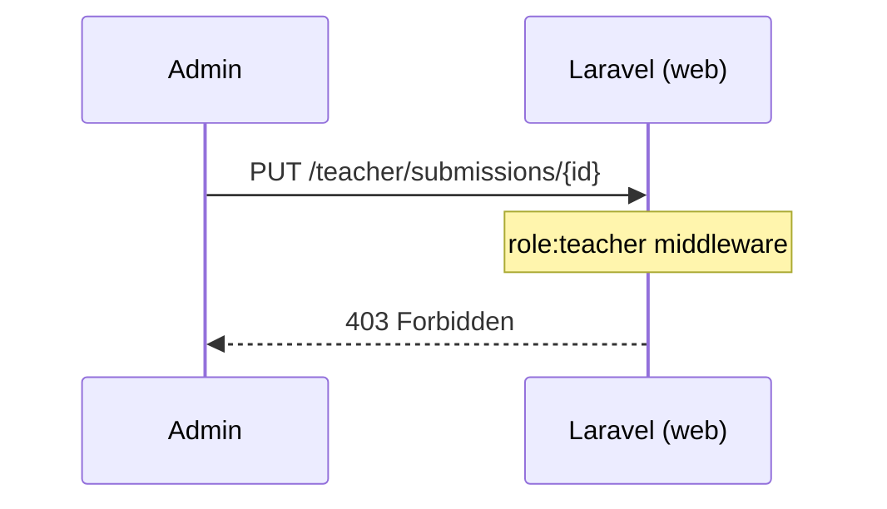

# Phase 2, Epic 4 — Admin Submission Review

**Epic:** P2-E4 — Admin read-only submission review  
**Spec:** [epic-16-admin-submission-review.md](../epics/epic-16-admin-submission-review.md)

---

## Sequence — Admin views a graded submission



---

## Sequence — Admin cannot grade



Only `Teacher\SubmissionController@update` persists marks. Admin has no PUT route for submissions.

---

## Manual testing

### Setup

```bash
php artisan migrate:fresh --seed
php artisan serve
```

| Account | Password | Role |
|---------|----------|------|
| admin | password | Admin |
| teacher | password | Teacher |
| student | password | Student |

### 1. Admin can browse submissions

1. Log in as **admin**.
2. Sidebar → **Submissions** (or dashboard → **View submissions**).
3. Confirm list loads with search, status filter, sort headers, pagination.
4. Open **By student** from the page header.
5. Confirm students grouped with **View** links.

### 2. Admin sees read-only detail

1. As admin, open a **completed** submission (not in progress).
2. Confirm **View only — teachers grade submissions** banner.
3. Confirm quiz metadata, question text, audio player (if Speak), MC context.
4. Confirm marks and feedback show as **text**, not input fields.
5. Confirm **Save grading** button is **not** present.

### 3. Teacher can still grade

1. Log out; log in as **teacher**.
2. **Grade** → open same submission.
3. Confirm mark inputs and **Save grading** work.
4. Save a grade; reload as admin and confirm marks appear read-only.

### 4. Role isolation

1. As **admin**, visit `/teacher/submissions` → expect **403**.
2. As **teacher**, visit `/admin/submissions` → expect **403**.
3. As **admin**, attempt PUT to `/teacher/submissions/{id}` (browser devtools or curl) → **403**.

### 5. Dashboard links

1. As admin on `/admin`, **Recent activity** → **View** opens `/admin/submissions/{id}`.
2. Quick action **View submissions** opens submission index.

---

## Database checks

No schema changes in this epic. After teacher grades:

```sql
SELECT status, total_mark, teacher_feedback FROM submissions WHERE id = ?;
SELECT mark, teacher_feedback FROM answers WHERE submission_id = ?;
```

Admin read-only views read these fields; they do not write them.
